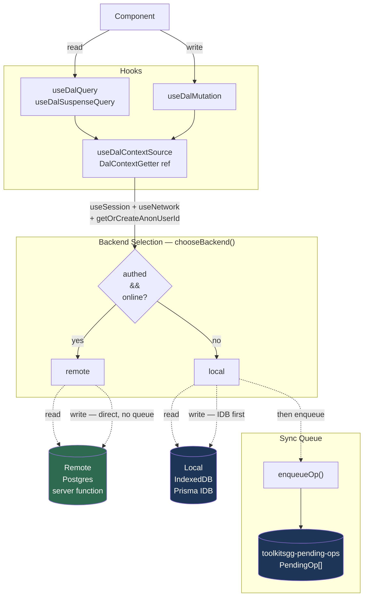
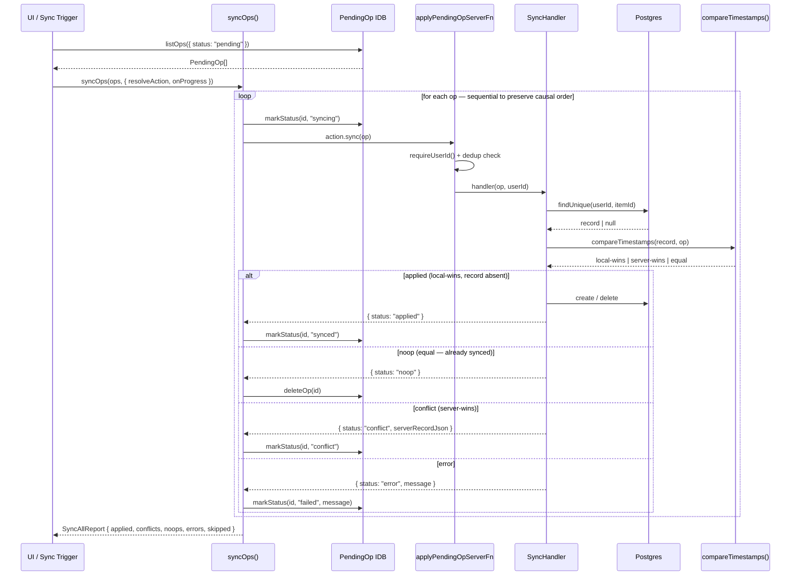
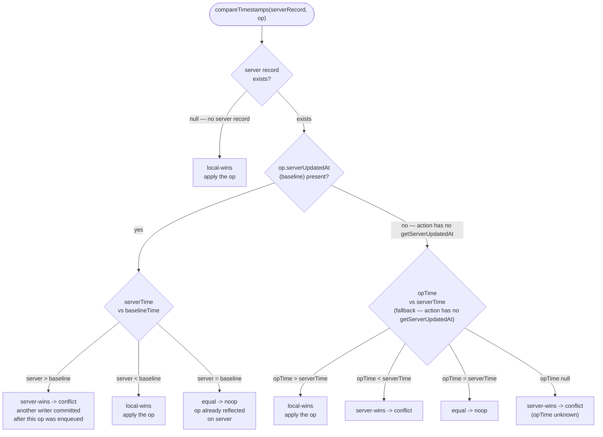

# DAL Architecture Diagrams

## Read / Write Flow

How components read and write data — and how local writes get queued for sync.

---

## Sync Flow

How queued `PendingOp`s travel from IndexedDB to the server when the user comes online.

---

## LWW Conflict Resolution

How `compareTimestamps()` decides whether a pending op should be applied, skipped, or treated as a conflict.

`op.serverUpdatedAt` is a snapshot of the server record's `updatedAt` captured **before** the local write. It acts as the baseline: if the server has moved past it by sync time, a concurrent writer won.

**Baseline tracking** is implemented for `collect` and `uncollect` actions via `getServerUpdatedAt`. Other actions (favorites, user-profile) use the fallback branch — add `getServerUpdatedAt` to their action definitions to upgrade them.

---

> _This documentation was generated with the help of AI, and reviewed and refined by a human._
